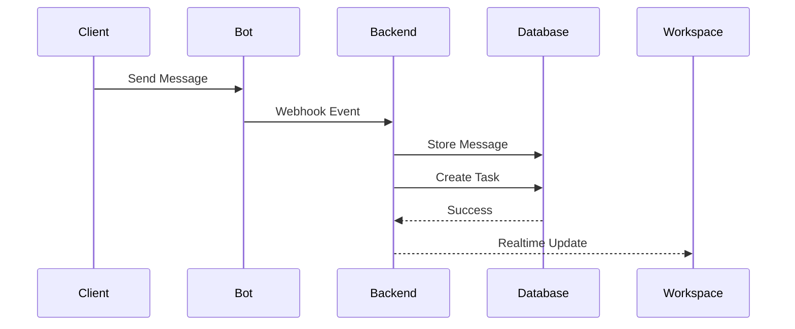
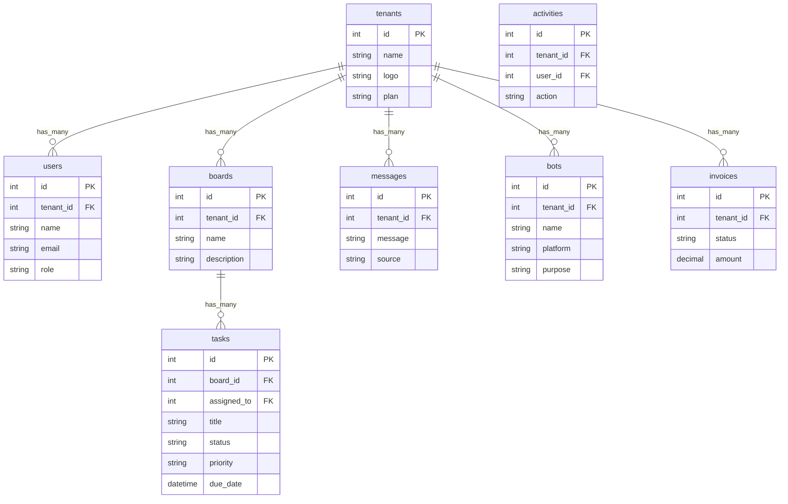

# PRD — OPERA Workspace
## Flexible Work Operating System for Business

---

# 1. Overview

OPERA adalah platform operasional bisnis berbasis web yang membantu bisnis mengelola pekerjaan, komunikasi tim, workflow, dan interaksi client dalam satu sistem terpusat.

Berbeda dengan software bisnis tradisional yang berfokus pada satu domain tertentu, OPERA dibangun dengan pendekatan:

> Semua aktivitas bisnis adalah Work.

Setiap aktivitas operasional:
- tugas internal
- permintaan client
- workflow tim
- laporan
- komunikasi
- operasional harian

dikelola dalam satu workspace terstruktur yang dapat:
- dilacak
- diorganisir
- didiskusikan
- dieksekusi

---

# 2. Requirements

## Functional Requirements

### Authentication
Sistem harus menyediakan:
- login
- register
- session management
- protected route

---

### Tenant Workspace
Setiap user wajib memiliki tenant/workspace.

Tenant memiliki:
- nama bisnis
- logo bisnis
- subscription plan

Semua data harus terisolasi berdasarkan tenant.

---

### Subscription Plan

#### Free Plan
- single user
- 1 bot
- limited automation
- basic operations

#### Pro Plan
- multi-user
- collaboration features
- multiple bot
- advanced workflow

#### Ultra Plan
- unlimited members
- unlimited automation
- advanced analytics
- priority features

---

## Non Functional Requirements

- Responsive web app
- Modern SaaS interface
- Real-time ready architecture
- Scalable multi-tenant system
- Fast dashboard interaction

---

# 3. Core Features

---

# 3.1 Dashboard

Dashboard menjadi pusat operasional tenant.

## Features
- Active Tasks
- Active Boards
- Team Summary
- Productivity Overview
- Recent Activities
- Quick Actions
- Automation Summary
- Performance Statistics

---

# 3.2 Task Management

Sistem pengelolaan pekerjaan harian.

## Features
- Create Task
- Update Task
- Delete Task
- Assign Member
- Due Date
- Priority Level
- Labels & Tags
- Task Status
- Checklist
- Task Discussion

---

# 3.3 Boards

Visual workspace untuk workflow operasional.

Boards dapat digunakan untuk:
- operational workflow
- client request tracking
- project flow
- production tracking
- support handling

---

## Features
- Kanban Board
- Drag & Drop
- Multi Status Column
- Work Categorization
- Task Grouping
- Board Filtering

---

# 3.4 Flows

Workflow management system.

## Features
- Custom Status
- Workflow Sequence
- Progress Tracking
- Workflow Rules

---

## Example Flow

```txt
Pending → In Progress → Review → Completed
```

Flow dapat disesuaikan sesuai kebutuhan tenant.

---

# 3.5 Calendar

Manajemen jadwal operasional.

## Features
- Task Deadline
- Team Schedule
- Event Tracking
- Calendar View
- Upcoming Activities

---

# 3.6 Team Collaboration

Sistem komunikasi internal tenant.

## Features
- Team Chat
- Work Discussion
- Mention User
- Shared Discussion
- Contextual Communication

---

# 3.7 Members & Permissions

Manajemen anggota workspace.

## Features
- Invite Member
- Remove Member
- Role Management
- Access Restriction

---

## Roles

### Owner
Full access.

### Admin
Operational management access.

### Staff
Limited operational access.

---

# 3.8 Inbox

Pusat seluruh komunikasi eksternal.

Inbox menerima:
- WhatsApp bot messages
- Telegram bot messages
- automation input
- client reports

---

## Features
- Unified Inbox
- Message History
- Convert Message → Task
- Message Categorization
- Reply Tracking

---

# 3.9 Bot Manager

Sistem automation untuk komunikasi client.

---

## Supported Platform
- WhatsApp
- Telegram

---

## Bot Features

Tenant dapat:
- membuat bot
- memberi nama bot
- menentukan tujuan bot

---

## Bot Use Cases

### Customer Service
Pesan client otomatis masuk sistem.

---

### Complaint Handling
Laporan client langsung dibuat task.

---

### Lead Collection
Bot mengumpulkan data calon client.

---

### Quick Report
Client dapat mengirim laporan cepat melalui chat.

---

## Features
- Bot Configuration
- Webhook Management
- Auto Reply
- Chat → Task Conversion
- Auto Assignment
- Trigger Workflow

---

# 3.10 Automations

Workflow automation system.

## Features
- Trigger-based automation
- Auto assignment
- Status automation
- Notification automation
- Workflow trigger

---

## Example
- Pesan masuk → buat task
- Task overdue → kirim notification
- Complaint → assign admin

---

# 3.11 Resources

Manajemen resource operasional bisnis.

---

## Products

### Features
- Product Data
- Product Categories
- Product Status
- Product Information

---

## Assets

### Features
- Asset Tracking
- Asset Categories
- Internal Resource Management

---

# 3.12 Finance

Sistem finansial ringan untuk operasional bisnis.

---

## Invoices

### Features
- Create Invoice
- Invoice Status
- Payment Tracking

---

## Transactions

### Features
- Income Tracking
- Expense Tracking
- Transaction History

---

# 3.13 Insights & Reports

Monitoring performa workspace.

---

## Features
- Productivity Analytics
- Workflow Statistics
- Team Performance
- Task Completion Rate
- Automation Performance

---

# 3.14 Notifications

Realtime system notifications.

---

## Notification Types
- assigned task
- mention
- workflow update
- overdue task
- automation activity
- inbox activity

Notifications muncul melalui:
- header dropdown
- dashboard widget

---

# 3.15 Activity Log

Riwayat seluruh aktivitas sistem.

---

## Features
- User Activity
- Task Activity
- Workflow History
- Automation Activity
- System Timeline

Activity log digunakan sebagai:
- tracking
- monitoring
- audit history

---

# 4. User Flow

---

# 4.1 New User Flow

1. User membuka landing page
2. Klik “Start Free”
3. Register akun
4. Membuat tenant
5. Masuk workspace dashboard

---

# 4.2 Daily Operational Flow

1. User membuka dashboard
2. Melihat task dan board aktif
3. Mengelola workflow
4. Berkomunikasi dengan tim
5. Menyelesaikan task
6. Monitoring progress operasional

---

# 4.3 Client Interaction Flow

1. Client mengirim pesan ke bot
2. Inbox menerima pesan
3. Sistem membuat task/work
4. Team menerima notification
5. Task diproses melalui workflow

---

# 5. Architecture



---

# 6. Database Schema



---

# 7. Design & Technical Constraints

## Design Direction

Design harus:
- modern
- clean
- monochrome
- workspace-oriented
- high-density SaaS interface

---

## Typography
- Primary Font: Aspekta
- Mono Font: JetBrains Mono

---

## Frontend Stack
- Next.js
- Tailwind CSS
- shadcn/ui
- Framer Motion
- lucide-react

---

## Backend Stack
- Supabase
- PostgreSQL
- Prisma ORM

---

## System Constraints
- Multi-tenant architecture mandatory
- Tenant data isolation mandatory
- Responsive mandatory
- Automation-ready architecture preferred

---

# Summary

OPERA adalah:

> Flexible Work Operating System untuk bisnis modern.

Platform ini menyatukan:
- pekerjaan
- workflow
- komunikasi
- automation
- collaboration
- operasional bisnis

ke dalam satu workspace terstruktur yang dapat digunakan oleh berbagai jenis bisnis.